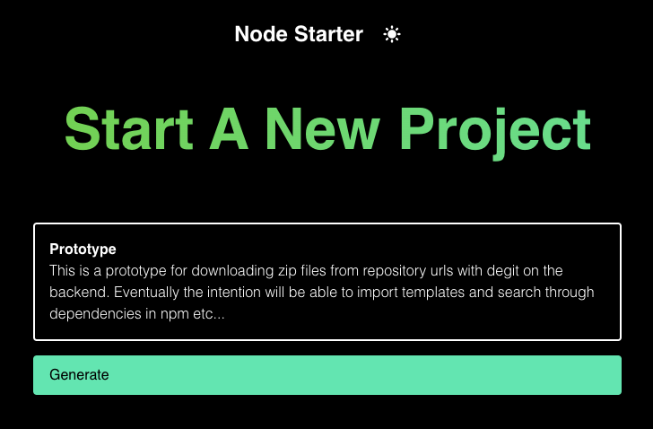

# Node Starter

Easily start a new node-based application.

**Work in progress - just for the mems this screenshot, we need forms and
templates now!**

## Roadmap

**Phase 1**: Prototype downloading preset git repo with preset archive now to
the client in the browser with [degit](https://github.com/Rich-Harris/degit).

**Phase 2**: Supply pre-configured templates to select from.

**Phase 3**: NPM dependency suggestions and search for common tasks.

**Phase 4**: Option to preview project files before downloading.

**Phase 5**: Option to clone directly to user's git repos.
